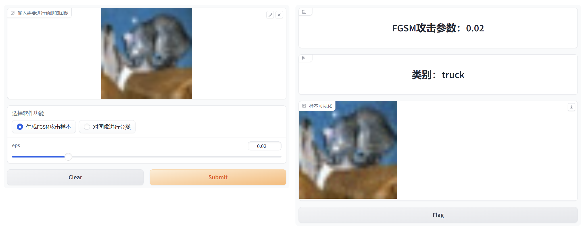
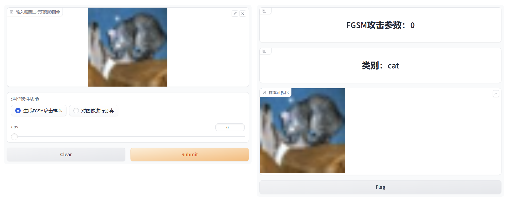

## Step1：对VGG16进行训练

### train.py

​	网络模型选用的是预训练的 VGG16 模型，数据集使用的是 CIFAR10 ，需要提前下载CIFA10数据集并存放在`datasets/cifar`路径中。使用 PyTorch 提供的 `transforms` 将数据集转换为 Tensor 格式，并使用 `DataLoader` 将数据集分成不同的 batch 进行训练。

​	`ckpt_fin.pkl` 文件是训练过程中的最终模型参数的保存文件，其中包含了模型的权重、偏置和其他必要的参数。这个文件可以被用于重新加载模型，或者用于推理和预测新数据的结果。

### classify.py

​	使用前面预训练的VGG16模型对测试集中的图像进行分类，并输出分类准确率和平均损失。

​	通过`testloader`加载图像，格式为PyTorch中的`Tensor`格式。

​	运行方式：

​	定义了参数`--image`/`-i`，可选clean、attack、rebuild

​	此处选择clean

```python
python classify.py -i clean
```

​	结果：


## Step2：生成攻击样本

### attack.py

​	使用fgsm方法对测试集的数据进行对抗攻击，从而生成对抗样本，这是一种针对神经网络的对抗性攻击方法，使用`torch.load`加载我们训练好的网络参数。

​	参数`epsilon`表示对每个像素点的扰动量，用于控制攻击的强度。该参数通常介于0和1之间，且值越大，攻击的效果越强。

​	具体的运行流程如下：

1. 通过`torch.load()`函数加载训练好的模型参数，生成测试模型对象`vggtest`，并将其移到GPU上
2. 设置扰动大小`eps`，并用FGSM方法生成对抗样本
3. 将生成的对抗样本图片和对抗样本图片以`.png`的格式分别保存到`sample/adv`和`sample/ori`文件夹下
4. 并将对抗样本图片和对抗样本图片以`.npy`格式保存到`sample/adv`和`sample/ori`文件夹下
5. 将图片的label以`.npy`格式保存在`sample`文件夹下

​	通过以下命令运行：

```python
# epsilon = 0.1
python attack2.py -eps 0.1
# epsilon = 0.05
python attack2.py -eps 0.05
# epsilon = 0.01
python attack2.py -eps 0.01
```

### classify.py

​	使用前面训练好的VGG16网络，对对抗样本进行分类。

​	图像输入格式为`npy`，先通过`torch.from_numpy`转为`Tensor`再进行分类。

​	运行命令：

​	定义了参数`--image`/`-i`，可选clean、attack、rebuild

​	此处选择attack

```
python classify.py -i attack
```

​	结果：

1. eps = 0.01

   

2. eps = 0.05

   

3. eps = 0.1

   

​	可见分类准确率比干净样本降低了很多，说明FGSM攻击有效。


## Step3：基于隐写分析的检测性防御

### spam.py

​	使用SPAM算法提取图像特征的Python脚本，它包括一些导入模块和参数解析器等常见操作。在该脚本中，函数`spam_extract_2`用于提取图像的SPAM特征，函数`SPAM`则用于循环处理一组图像数据，提取它们的SPAM特征，并返回整个特征矩阵。最后，函数`gen_feature`用于生成和保存特征文件，特征保存在`features`文件夹。

​	干净样本和对抗样本的spam特征分别保存为`adv_f.npy`和`clr_f.npy`

## fisher.py

​	实现加载图像的spam特征并使用Fisher线性判别分析分类器对图像进行分类。该分类器首先使用spam特征数据进行训练，然后对新的spam特征数据进行预测。在这里，特征数据包括干净样本和对抗样本的特征，并且它们被组合成一个特征矩阵。

​	最后输出分类器的预测准确略结果。

​	运行方式：

```python
# epsilon = 0.1
python fisher.py -eps 0.1
# epsilon = 0.05
python fisher.py -eps 0.05
# epsilon = 0.01
python fisher.py -eps 0.01
```

​	运行结果：

eps = 0.01 : 


eps = 0.05:


eps = 0.1:


​	可见eps在0.05/0.1时，基于spam特征的fisher分类器的分类准确率较高，特别是在eps为0.1时，分类准确率达到91.975%，说明基于隐写分析的检测性防御能够有效检测出对抗样本，说明可以有效地将对抗样本和干净样本进行分离，这为后续的鲁棒性防御奠定了基础。


## Step4：基于区域重建的鲁棒性防御

### cam_gray_binary.py

​	使用了PyTorch `Grad-CAM`库来生成类激活图像，可以用于可视化神经网络在测试集上的表现。后续通过类激活映射得到神经网络关注的部分，然后对关注部分进行重建。

​	首先加载测试集并加载训练好的VGG模型，然后选择目标层，并使用`Grad-CAM`库来生成灰度类激活图像。随后，将灰度类激活图像进行二值化和颜色映射处理，并将原始测试图像和彩色类激活图像叠加在一起得到的 CAM 可视化图像，并保存在`cam_gray_binary`文件夹。

​	以下为对结果图像的详细解释：

```python
# ori_{:05d}.png: 原始测试图像的可视化
# cam_gray_{:05d}.png: 使用 Grad-CAM 生成的灰度类激活图像
# cam_binary_{:05d}.png: 将灰度类激活图像二值化得到的二值图像，用于更好地可视化类激活区域
# cam_jet_{:05d}.png: 将灰度类激活图像应用颜色映射后得到的图像
# stk_{:05d}.png: 将原始测试图像和彩色类激活图像叠加在一起得到的 CAM 可视化图像
```

​	运行方式：

```python
python cam_gray_binary.py
```

### fgsm_remove.py

​	将每个对抗样本中的mask（即cam_binary）对应位置的像素修改为白色，得到一个“缺失”像素的对抗样本。遍历每个对抗样本和对应的mask图像，并使用PIL库修改像素值，然后保存新的对抗样本，分别以`png`格式和`npy`格式保存，结果保存在`fgsm_remove`文件夹。

### rebuild.py

​	因为CIFAR10数据集的图像像素较低，在**像素较低**的图像上，使用**插值方法**进行修复可能效果更好，因为这些图像本身的特征和规律比较简单，而插值方法可以很好地利用这些特征和规律来进行图像修复。	

​	使用了OpenCV库和Pillow库来对FGSM攻击后的图像进行修复。

​	遍历对应的掩膜图像，用于确定需要修复的像素点位置。读取需要修改的图像，即即上一部的结果`./fgsm_remove/remove.npy`，存放于`fgsm_remove`文件夹中。使用基于邻域像素的插值方法进行插值操作，对于每个缺失像素点，使用OpenCV的函数进行插值。保存修改后的图像到`fgsm_rebuild`文件夹中。

​	运行方式：

```python
python rebuild.py
```

（对于高像素的图像，我们使用了特征引导的去噪网络对对抗样本进行去噪，并发表IEEE会议论文）          

### 最后对重建后的图像进行分类

​	运行：

```
python classify.py -i rebuild
```

结果：


## 三生网络（对抗训练）（鲁棒性防御）


1. 我们首先用vgg16和cifar10数据集运行0_Learning的1_train.py和2_acc.py，生成网络模型data_model.pth
2. 然后用第一步训练好的网络data_model.pth作为输入，运行1_Adversary的0_generate.py生成对抗样本，存放在data_adv中
3. 然后用第一步训练好的网络data_model.pth作为输入，使用对抗样本作为训练集和测试集，运行2_Advetraining的0_train.py生成网络模型data_model_adv.pth
4. 再用第三步对抗训练生成的网络data_model_adv.pth运行1_Adversary的0_generate.py再生成对抗样本，存放在data_adv_adv中
5. 最后用第二步生成的对抗样本，和第四步生成的对抗样本同时作为训练集和测试集，运行3_train_f3的0_train.py生成三成网络，保存在data_model_F3中
6. 用第一步、第三步、第五步生成的网络生成三生网络同时进行决策（投票）

结果：

准确率：

原始网络：

* test干净样本：0.8547
* test对抗样本：0.1549

对抗训练的网络：

* test干净样本：0.7527
* test对抗样本：0.95488

用`对抗样本和对抗训练网络生成的对抗样本`训练的网络：

* 干净样本：0.7788
* 对抗样本：0.96594

三生网络：

* test干净样本：0.8161
* test对抗样本：0.94066


## Gradio可视化

```python
python show.py
```







三生网络作用：

1. 在稍微牺牲干净样本分类准确率的同时，大幅提高对抗样本分类准确率。
2. 比双生网络的效果更好，第三个网络可以增强对抗样本的识别能力，训练用的对抗样本的强度更高（用对抗训练后的网络生成的对抗样本）


提升空间：三生网络的权重应该根据各自的置信度进行调整。


